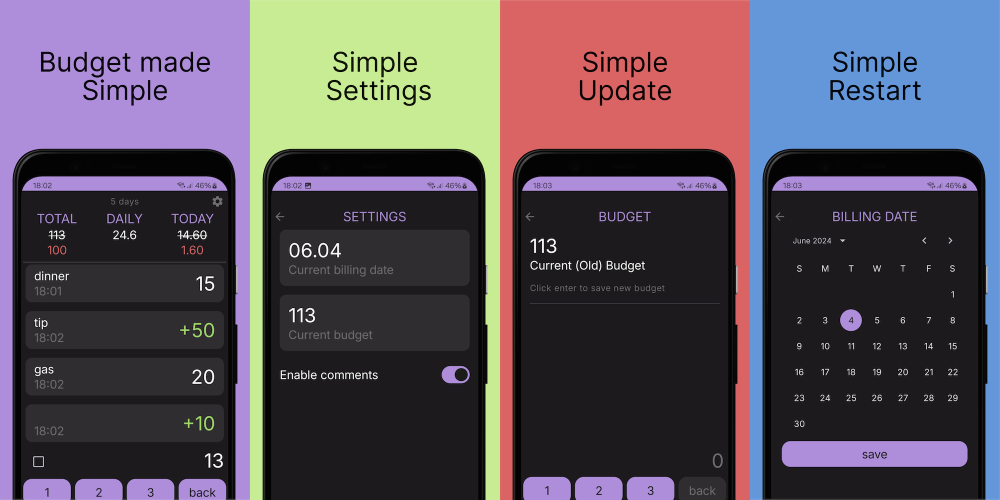

# Simple Budget for Android

Simple Budget is a budget application for Android. It allows you to track your expenses, and see
your remaining balance equally divided for each day. It is simple and easy to use
application that helps you start managing your finances.

## Features

- Add or remove transactions with ease, and add optional comments for context
- Preview your balance when entering new transaction to see how it will affect your budget
- View your spending history
- Set a total budget and adjust it as needed
- All data is persisted on-device in a database

## Motivation

I needed personal budget solution but didn't find anything that suits me.

I tried to create [my own](https://github.com/glebkrep/KnowYourBudget) back in 2021, but didn't have
time to do it, and now it's too far conceptually from what I need.

This project will also be a testing ground for new technologies I'd like to try.

## Built with

- [Jetpack Compose](https://developer.android.com/jetpack/compose)
- [Room](https://developer.android.com/training/data-storage/room)
- [Proto DataStore](https://developer.android.com/topic/libraries/architecture/datastore)
- [Kotlin Coroutines](https://kotlinlang.org/docs/coroutines-overview.html)
  and [Flow](https://kotlinlang.org/docs/flow.html)
- [Hilt](https://developer.android.com/training/dependency-injection/hilt-android)
- Testing:
    - Unit tests for business logic
    - [Kaspresso](https://github.com/KasperskyLab/Kaspresso) for UI tests
    - [Mockk](https://mockk.io/) for mocking
- Other:
    - Modular architecture
    - Gradle version catalog
    - [Gradle convention plugins](https://github.com/glebkrep/SimpleBudget/tree/master/build-logic)
      for configuring modules
    - [Detekt](https://detekt.dev/) for static code analysis
    - [Baseline Profiles](https://developer.android.com/topic/performance/baselineprofiles/overview)
    - [Custom Lint Rules](https://github.com/glebkrep/SimpleBudget/tree/master/lint)
    - Pre-commit hooks for running linters and unit tests
    - [Github Actions](https://github.com/glebkrep/SimpleBudget/actions) for running linters and
      tests, building releases
